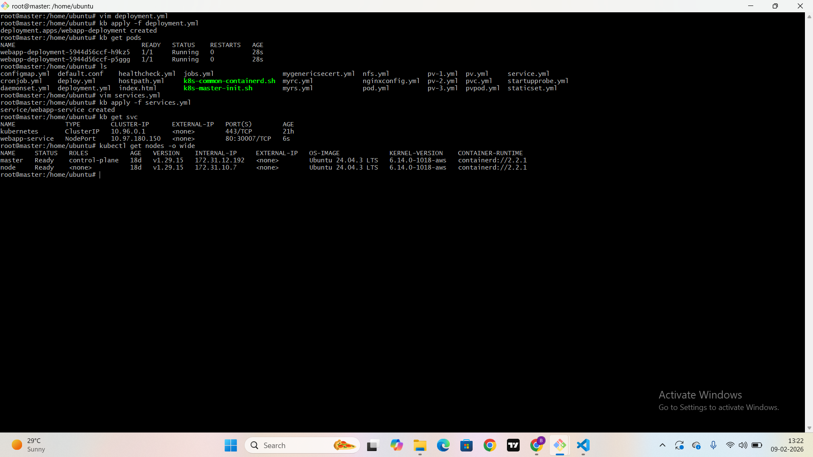
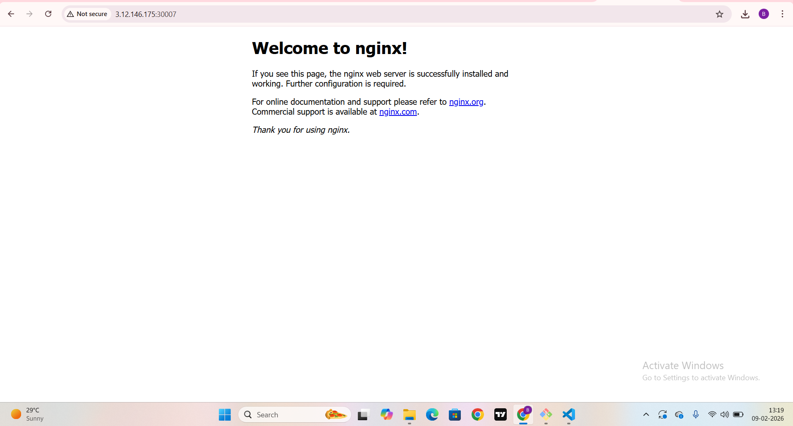

# K8S-Test

### MCQ-Type-Question

### Q1. What is the smallest unit that Kubernetes deploys?
- Ans: Pod

### Q2. Which Kubernetes object is used to expose pods to network traffic?
- Ans: Service

### Q3. Which Service type is used only for internal communication inside the cluster?
- Ans: ClusterIP

### Q4. You want to access an application using NodeIP:Port Which Service type should you use?
- Ans: NodePort

### Q5. Which Service type is mainly used in cloud environments to expose applications externally

- Ans: LoadBalancer

### Q6. A pod is deleted accidentally. Which pod type can automatically recreate it?
- Ans: Pod managed by Deploymen

### Q7. Which pod type is used to run initialization tasks before the main container starts ?
- Ans : Init Pod

### Q8. Containers inside the same pod communicate using:
- Ans : Same Ip Address

### Q9. Which Service assigns a stable internal IP address automatically?
- Ans : ClusterIP

### Q10. You created a Service, but traffic is not reaching the pod.What is the most common reason?
- Ans :  Label mismatch

### Q11. Which Kubernetes component provides DNS-based service discovery?
- Ans : CoreDNS

### Q12. You want a pod to always run on a specific node. Which pod type is used?
- Ans : Static Pod

### Q13. Which Service type exposes a fixed port on every node?
- Ans : NodePort

### Q14. You want pods inside the cluster to access an application using a DNS name.Which Service type should you use?

- Ans : ClusterIP

### Q15. Which command shows the IP address of a pod?

- Ans : kubectl get pods -o wide

### Q16. You created a LoadBalancer Service in a local cluster. What usually happens?
- Ans : External IP stays pending

### Q17. Which pod type is commonly used to support a main application with logging or monitoring?
- Ans :  Sidecar Pod

### Q18. Which Service field decides which pods receive traffic?
- Ans : Selector

### Q19. Which command is used to list all Services in a namespace?
- Ans : kubectl get svc

### Q20. Two pods in the same namespace want to communicate. What is the recommended Kubernetes way?
- Ans : Use Service Name

# Kubernetes Web Application Deployment

## Deployment Name
webapp-deployment

## Service Type Used
NodePort

## Application Access URL
http://<NodeIP>:<NodePort>

Example:  
http://3.12.146.175:30007/

## Browser Output Screenshot

![Application Output]

## Verification
The application was successfully deployed using a Kubernetes Deployment with 2 replicas.  
All pods are in **Running** state.  
The application is exposed using a **NodePort Service** and is accessible from the browser using the above URL.
